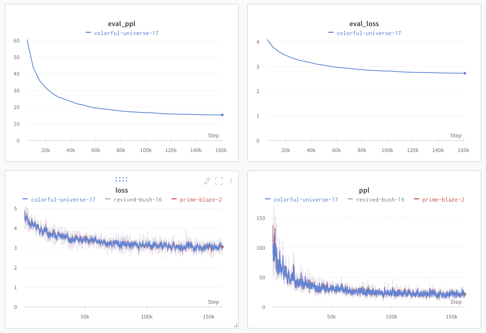

# JAX Language Model Training

> Currently this repo is under construction :) 

## todos

- [X] writing corpus tokenizing and featurizing code with Apache Beam (done at 5/6)
- [X] writing training code with single GPU
- [X] writing evaluation code with single GPU
- [X] writing metric tracking code with weight&bias
- [X] train LM with single GPU and debug!
- [X] writing parallelism code for multi-GPUs support.
- [X] train LM with multi-GPUs and debug!
- [ ] training in TPU and TPU-Pod
- [ ] result comparison GPU, GPUs, TPU, TPU-Pod
- [ ] writing similar code with pytorch and compare the training performance


## step1. Pre-Featurize Corpus with Apache Beam

`jax_lm.preprocess` script download the corpus and process to trainable model input. 
I wrote the Apache Beam pipeline to process corpus and export the output with Apache Parquet.

[Apache Beam](https://beam.apache.org/get-started/beam-overview/) is an open source, unified model for defining both batch and streaming data-parallel processing pipelines.
And [Google Dataflow](https://cloud.google.com/dataflow?hl=ko) automatically parallelize Apache Beam Pipeline which could accelerate huge corpus processing time with blazing speed!
(Well, Dataflow processing code is not implemented in this repo yet. I'll do it soon! )

[Apache Parquet](https://parquet.apache.org) is an open source, column-oriented data file format designed for efficient data storage and retrieval. 
It provides efficient data compression and encoding schemes with enhanced performance to handle complex data in bulk.
[huggingface/dataset](https://huggingface.co/docs/datasets/index) can directly load Parquet file!
 So we just need to used huggingface/dataset when we are training :)

The detail of procedures are described as follow.

1. Download the text corpus from huggingface/dataset 
2. Convert the huggingface/dataset to Apache Beam PCollection
3. Tokenize using huggingface/tokenizer with Apache Beam DoFn
4. Chunk tokens into number of input_ids with Apache Beam DoFn
5. Add BOS, EOS, PAD token and make it to model inputs(feature) with Apache Beam DoFn
6. Write the featurized PCollection into Apache Parquet file
7. Now ready to train model!

```shell
python -m jax_lm.preprocess \
    --tokenizer-model "gpt2" \
    --min-sequence-length 128 \
    --max-sequence-length 256 \
    --num-special-token-reserved 2 \
    --ignore-label -100 \
    --stride 128 \
    --dataset-name "wikitext" \
    --dataset-sub-name "wikitext-103-v1" \
    --dataset-split-type "train" \
    --output-path "dataset/wikitext.train" \
    --direct_running_mode "multi_processing" \
    --direct_num_workers 0
```

```python
from datasets import Dataset

dataset = Dataset.from_parquet("data/wikitext.train*")
```

## step2. Train model

`jax_lm.train` script run model training with multi-gpu support!

```shell
python -m jax_lm.train \
    --model-config-name "gpt2" \
    --train-dataset-paths "dataset/wikitext.train**" \
    --eval-dataset-paths "dataset/wikitext.test**" \
    --batch-size 16 \
    --random-seed 0 \
    --max-sequence-length 256 \
    --num-epochs 5 \
    --learning-rate 3e-5 \
    --dtype float32 \
    --wandb-username "codertimo" \
    --wandb-project "jax-lm-training" \
    --wandb-run-dir ".wandb" \
    --logging-frequency 100 \
    --eval-frequency 5000 \
    --save-frequency 5000 \
    --model-save-dir "artifacts/"
```

**Training Logs**

```
[TRAIN] epoch: 0 step: 100/161045 loss: 8.8082 ppl: 6688.58 ETA 23:14:51 
[TRAIN] epoch: 0 step: 200/161045 loss: 5.8967 ppl: 363.83 ETA 09:49:45 
[TRAIN] epoch: 0 step: 300/161045 loss: 5.0164 ppl: 150.87 ETA 09:49:23 
...
[TRAIN] epoch: 4 step: 160800/161045 loss: 3.2986 ppl: 27.07 ETA 00:00:53 
[TRAIN] epoch: 4 step: 160900/161045 loss: 3.0941 ppl: 22.07 ETA 00:00:31 
[TRAIN] epoch: 4 step: 161000/161045 loss: 3.0417 ppl: 20.94 ETA 00:00:09 
[EVAL] epoch: 4 step: 161044/161045 loss: 2.7272 ppl: 15.29 
save checkpoint to artifacts/ 
```

## step 3. Watching W&B and chill

[codertimo/jax-lm-training W&B Board](https://wandb.ai/codertimo/jax-lm-training?workspace=user-codertimo)



You can see the training logs with beautiful graph and logging at W&B!


